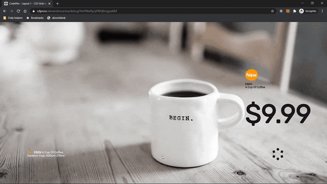

# Layout 1 - CSS Grid example

Practice working with CSS Grid Layout by applying CSS rules both the parent element and the element's children and providing fallback for the browser that do not support CSS grid.

[Live example on CodePen](https://codepen.io/alexandracaulea/full/VwYMwRp)

