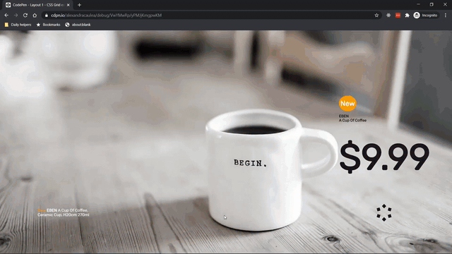

# CSS Grid Layout examples

When I've first started coding I decided to learn more about CSS Grid and how to use it. I've created 9 layout examples to force myself to work with CSS Grid.

| #   | Project name | Live example                                            | Code on GitHub                                                             |
| :-- | ------------ | ------------------------------------------------------- | -------------------------------------------------------------------------- |
| 1.  | Layout 1     | [Demo](https://codepen.io/alexandracaulea/full/VwYMwRp) | [Check the code](https://github.com/alexandracaulea/layouts/tree/master/1) |
| 2.  | Layout 2     | [Demo](https://codepen.io/alexandracaulea/full/QWwmdPG) | [Check the code](https://github.com/alexandracaulea/layouts/tree/master/2) |
| 3.  | Layout 3     | [Demo](https://codepen.io/alexandracaulea/full/ZEYoGmz) | [Check the code](https://github.com/alexandracaulea/layouts/tree/master/3) |
| 4.  | Layout 4     | [Demo](https://codepen.io/alexandracaulea/full/ZEYoaPe) | [Check the code](https://github.com/alexandracaulea/layouts/tree/master/4) |
| 5.  | Layout 5     | [Demo](https://codepen.io/alexandracaulea/full/abzGrjz) | [Check the code](https://github.com/alexandracaulea/layouts/tree/master/5) |
| 6.  | Layout 6     | [Demo](https://codepen.io/alexandracaulea/full/wvBxGYr) | [Check the code](https://github.com/alexandracaulea/layouts/tree/master/6) |
| 7.  | Layout 7     | [Demo](https://codepen.io/alexandracaulea/full/JjoBwZL) | [Check the code](https://github.com/alexandracaulea/layouts/tree/master/7) |
| 8.  | Layout 8     | [Demo](https://codepen.io/alexandracaulea/full/JjoavbN) | [Check the code](https://github.com/alexandracaulea/layouts/tree/master/8) |
| 9.  | Layout 9     | [Demo](https://codepen.io/alexandracaulea/full/Exaddav) | [Check the code](https://github.com/alexandracaulea/layouts/tree/master/9) |

